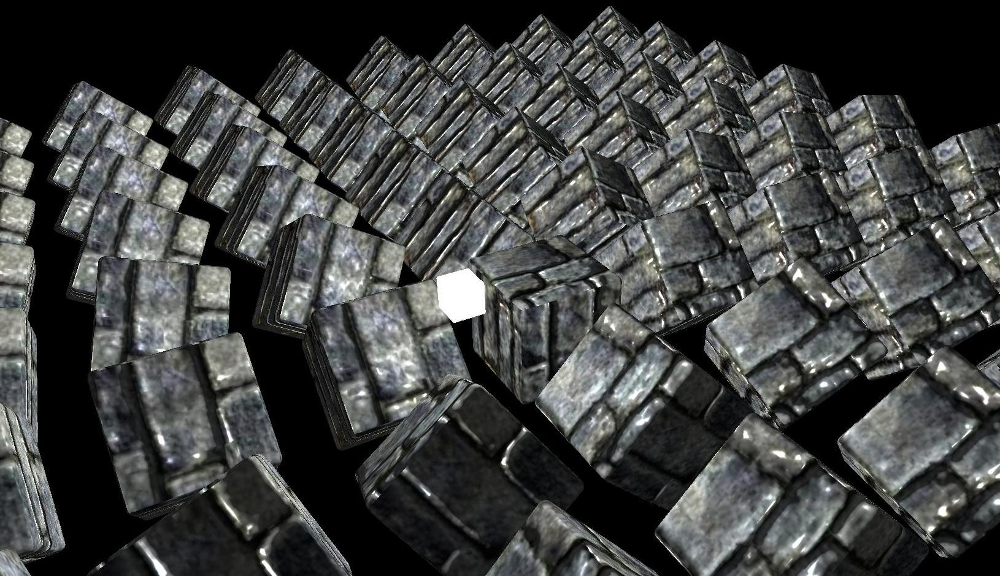

# Using wgpu to render a 3D scene

[https://wgpu.rs/](https://wgpu.rs/)

Based on the following tutorial:
 - [https://sotrh.github.io/learn-wgpu/](https://sotrh.github.io/learn-wgpu/)

### Dependencies

Install cargo and the rust toolchain:
- [https://www.rust-lang.org/tools/install](https://www.rust-lang.org/tools/install)

### Build and run

```shell
$ cd <project-directory>
$ cargo run
```

### Camera Controls

| Input                    | Result               |
|--------------------------|----------------------|
| WASD / Arrow Keys        | Move camera position |
| Left Shift               | Lower camera         |
| Space Bar                | Raise camera         |
| Hold left mouse and drag | Look around          |

### Results


